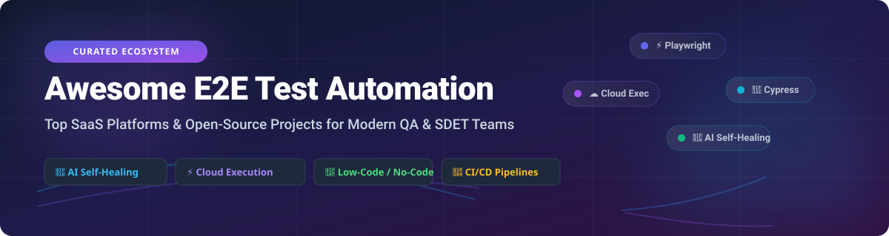

# Awesome End-To-End Test Automation 🚀

  
  
  
  

## 🌐 Overview & Ecosystem Insights

Welcome to the **Awesome End-To-End (E2E) Test Automation** curated collection! 🧪✨ This repository tracks leading **SaaS testing platforms** and **open-source testing frameworks** spanning web, mobile, and API testing. It helps QA engineers, SDETs, developers, and product teams evaluate solutions for low-code/no-code test authoring, AI self-healing locators, cloud parallel execution, and CI/CD pipeline integration.

### 📊 Market Size & Industry Dynamics

> 💡 **Market Size & Structure**: The Global Automated Software Testing Market is estimated at **~$28 Billion** and is projected to reach **~$50+ Billion by 2030**. The sector is **moderately fragmented**: while foundational open-source execution engines (Playwright, Selenium, Cypress) dominate test authoring, commercial SaaS vendors fiercely compete across specialized niches like AI autonomous agents, visual testing, and managed cloud infrastructure.

---

## 📚 Table of Contents
- [☁️ SaaS / Managed Testing Platforms](#-saas--managed-testing-platforms)
- [🔓 Open-Source GitHub Projects](#-open-source-github-projects)
- [🤝 How to Contribute](#-how-to-contribute)
- [💖 Support & Sponsorship](#-support--sponsorship)
- [📈 Star History](#-star-history)
- [⚠️ Disclaimer](#️-disclaimer)

---

## ☁️ SaaS / Managed Testing Platforms

Below is a comparison of top commercial E2E testing SaaS products, sorted descending by company size (valuation / total funding raised).

| Product / Platform | Company Size (Valuation / Funding) | Starting Tier Pricing | Free Tier / Trial Limits | Key Features & Highlights |
| :--- | :--- | :--- | :--- | :--- |
| **[Playwright Workspaces](https://learn.microsoft.com/en-us/azure/app-testing/playwright-workspaces/)** | **~$3.1 Trillion** *(Microsoft)* | **$0.01 / test minute** | **30-day Free Trial** *(100 browser minutes)* | Fully managed Azure cloud browser platform for Playwright. Enables massive parallel execution, cross-OS browser testing, and remote MCP servers for AI agents. |
| **[Testim](https://www.testim.io/)** | **~$4.5 Billion** *(Acquired by Tricentis)* | **$450 / month** | **Free Forever Plan** *(500 test runs/mo, 1 project)* | AI-powered UI & E2E testing. Features AI Smart Locators that minimize maintenance by evaluating DOM attributes continuously. |
| **[Cypress Cloud](https://www.cypress.io/cloud)** | **~$300 Million** *(Series B, $54M+ funding)* | **$75 / month** *(Team plan)* | **Free Starter Plan** *(500 test results/mo, 10 users)* | Official Cypress cloud platform. Features Test Replay interactive debugging, Flake Detection, Smart Orchestration, and CI integration. |
| **[QA Wolf](https://www.qawolf.com/)** | **~$150 Million** *(Series B, $36M+ funding)* | **$3,000 / month** | **14-day Free Trial** *(Full pilot evaluation)* | Fully managed E2E testing service promising 80% automated test coverage in 4 months. Customer retains 100% ownership of Playwright code. |
| **[ACCELQ](https://www.accelq.com/)** | **~$100 Million+** *(Series B funded)* | **$150 / user / month** | **14-day Free Trial** *(Full platform access)* | AI-native codeless platform structured around Application Universe blueprints. Autonomous scenario generation and multi-channel E2E testing. |
| **[mabl](https://www.mabl.com/)** | **~$100 Million+** *($77M+ funding)* | **$600 / month** | **14-day Free Trial** *(Full features access)* | Unified low-code testing platform covering UI, API, accessibility, visual, and email testing with AI auto-healing locators and Intelligent Wait. |
| **[Functionize](https://www.functionize.com/)** | **~$80 Million+** *($50M+ funding)* | **$500 / month** | **14-day Free Trial** *(Architect extension demo)* | Autonomous E2E testing using digital workers (EAI Agents). Creates tests from plain English prompts, recordings, or real user behavior observation. |
| **[testRigor](https://testrigor.com/)** | **~$50 Million+** *($10M+ funding)* | **$900 / month** *(Private plan)* | **Free Public Plan** *(Unlimited tests for open public suites)* | Generative AI-native test automation. Allows writing end-to-end test cases in plain no-code English with cross-platform web, mobile, and desktop support. |
| **[Autify](https://autify.com/)** | **~$40 Million+** *($15M+ funding)* | **$500 / month** | **14-day Free Trial** *(Full platform features)* | No-code AI test automation tailored for non-technical users. Autify Genesis enables AI-generated test specs directly from GitHub PRs. |
| **[Reflect](https://reflect.run/)** | **~$15 Million** *($4.7M funding)* | **$199 / month** | **14-day Free Trial** *(50 test runs included)* | Cloud-based no-code test automation platform supporting cross-browser execution, visual regression testing, and video test recording. |

---

## 🔓 Open-Source GitHub Projects

Below are top open-source E2E testing frameworks, tools, and libraries, sorted descending by GitHub Star Count.

- **[Playwright](https://github.com/microsoft/playwright)**  ⚡
  Node.js, Python, Java, and .NET library to automate Chromium, Firefox, and WebKit with a single API. Built by Microsoft. Offers auto-waiting, trace viewer, network interception, and web-first assertions. *(Apache-2.0)*

- **[Puppeteer](https://github.com/puppeteer/puppeteer)**  🎪
  JavaScript browser automation library providing a high-level API to control Chrome or Chromium over the DevTools Protocol. Ideal for scraping, PDF generation, and lightweight E2E test scripts. *(Apache-2.0)*

- **[Cypress](https://github.com/cypress-io/cypress)**  🌲
  Developer-friendly JavaScript E2E and component testing framework running inside the browser. Provides real-time reloading, time-travel debugging, and automatic waiting. *(MIT)*

- **[Bruno](https://github.com/usebruno/bruno)**  🐶
  Fast and git-friendly open-source API client for testing and collection execution. Stores collections directly in plain text files in your repository. *(MIT)*

- **[Selenium](https://github.com/SeleniumHQ/selenium)**  🌐
  The original browser automation standard. W3C WebDriver protocol supported natively across all major browsers with language bindings for Java, Python, C#, Ruby, and JavaScript. *(Apache-2.0)*

- **[Appium](https://github.com/appium/appium)**  📱
  Cross-platform mobile automation framework extending WebDriver protocol to iOS, Android native, hybrid, and mobile web apps across real devices and emulators. *(Apache-2.0)*

- **[Hurl](https://github.com/Orange-OpenSource/hurl)**  🚀
  Command-line tool driven by plain text files to run HTTP requests and perform API E2E testing with fast execution and easy CI integration. *(Apache-2.0)*

- **[Dagger](https://github.com/dagger/dagger)**  🗡️
  Programmable CI/CD engine that runs pipelines in containers. Used to orchestrate E2E test environments locally and in CI seamlessly. *(Apache-2.0)*

- **[Midscene.js](https://github.com/web-infra-dev/midscene)**  🤖
  AI-driven UI test automation tool that uses multimodal LLMs to understand DOM structures and execute natural language testing instructions. *(MIT)*

- **[Robot Framework](https://github.com/robotframework/robotframework)**  🤖
  Generic open-source automation framework using tabular keyword-driven syntax for web, mobile, and API testing. *(Apache-2.0)*

- **[Karate](https://github.com/karatelabs/karate)**  🥋
  Unified testing framework combining API test-automation, mocks, performance-testing, and Web UI automation into a single BDD-style framework. *(MIT)*

- **[Testcontainers](https://github.com/testcontainers/testcontainers-java)**  🐳
  Lightweight library supporting throwaway Docker container instances for integration and E2E testing against real databases and queues. *(MIT)*

- **[BackstopJS](https://github.com/garris/BackstopJS)**  📸
  Visual regression testing tool that renders screenshots across multiple screen sizes and reports layout differences. *(MIT)*

- **[Allure Report](https://github.com/allure-framework/allure2)**  📊
  Flexible, lightweight multi-language test report tool providing clear visual graphs and step-by-step diagnostic information for E2E runs. *(Apache-2.0)*

- **[CodeceptJS](https://github.com/codeceptjs/CodeceptJS)**  🎭
  Supercharged BDD-style JavaScript testing framework using high-level human-readable syntax built over Playwright, WebDriver, or Puppeteer. *(MIT)*

- **[Gauge](https://github.com/getgauge/gauge)**  📐
  Cross-platform test automation framework emphasizing Markdown specs as executable tests for business-readable test suites. *(Apache-2.0)*

- **[ReportPortal](https://github.com/reportportal/reportportal)**  📉
  AI-powered central test reporting and analytics dashboard for managing E2E test execution metrics across pipelines. *(Apache-2.0)*

- **[reg-suit](https://github.com/reg-viz/reg-suit)**  🎯
  Visual regression testing CLI tool that compares snapshots, stores images on S3/GCS, and sends report notifications directly to GitHub PRs. *(MIT)*

---

## 🤝 How to Contribute

1. **Fork** the repository.
2. Edit entries in `README.md` following the standard table or list format.
3. Include: Tool Name, Link, Brief Description, Pricing/Stars, and License.
4. Submit a **Pull Request** with a concise summary.

---

## 💖 Support & Sponsorship

If you find this repository helpful, please consider giving it a ⭐ **Star**, **Forking** it, or **Sharing** it with your developer community!

Your support helps maintain and grow this awesome ecosystem list. If you'd like to support the ongoing maintenance directly, consider sponsoring:

---

## 📈 Star History

---

## ⚠️ Disclaimer

- This is a **community-curated** list — it is not exhaustive and does not constitute an endorsement.
- End-to-end testing platforms may process sensitive application data and credentials; ensure secure credential storage following least privilege principles.
- **Open-Source vs SaaS**: Core execution engines (Playwright, Cypress, Selenium) are open-source and mature. SaaS platforms add value around cloud concurrency, AI self-healing, visual regression, and reporting dashboards.

---

  <b>Built for QA Engineers, SDETs, Test Architects, and DevOps Teams.</b> 
  <i>Making E2E test automation open, scalable, and reliable.</i>

